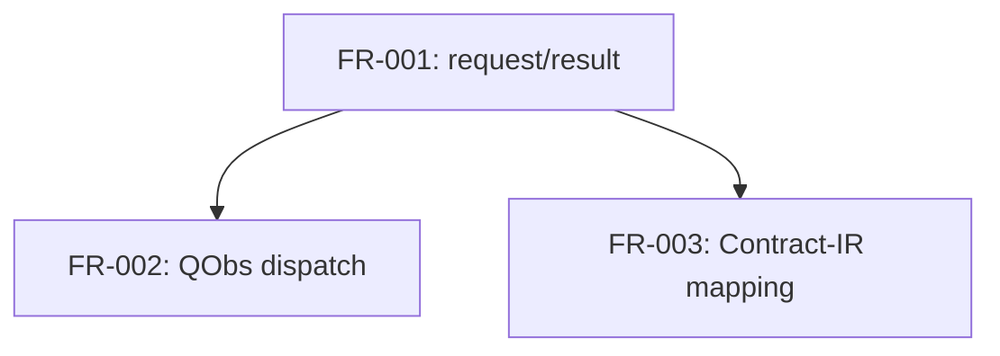

## Summary

Reviewed the cross-repository dependency edges declared by the six artifacts
authored for TL-177 (MRS-001, FR-001, FR-002, FR-003, NFR-001, ADR-001). The
graph is acyclic: FR-001 is the sole enablement requirement (it is also
independently feature-visible — the temporal-assessment request/result pair
is the crate's core behavior, not pure scaffolding); FR-002 and FR-003 are
features that both depend only on FR-001 and on nothing else in this repo. No
edge points back into a downstream requirement, and no edge is asserted
between two artifacts whose bodies do not actually rely on each other — every
cross-repo citation was checked against the real `use` imports and function
calls in the `tl-mltl` source being ported
(`src/wire/{request,observation,report}.rs`,
`src/mapping/contract_ir.rs`).

## Dependency Graph

## Topological Order

1. FR-001 (enablement + feature)
2. FR-002, FR-003 (features, parallelizable once FR-001 lands)

## Cross-repo citation check

| Edge | Verified against |
|---|---|
| MRS-001 depends_on tl-mltl/MRS-001, quire-observation/MRS-001, quire-contract-ir/PGM-01 | Matches the existing seeded placeholder plus the added PGM-01 governance edge this ticket's own rationale requires. |
| FR-001 depends_on tl-mltl/FR-018 | FR-018 is the direct ancestor of the ported wire boundary and, in `tl-mltl`'s own graph, already depends on `tl-mltl` FR-001/FR-003 (future evaluation) and `tl-syntax` FR-011/FR-012 (past semantics) that `report.rs::execute()` calls into — covered transitively rather than re-cited directly. |
| FR-001 depends_on quire-observation/FR-004 | FR-004 owns exactly the `authority::{clock,progress,closure,completeness,availability}` module set `request.rs` imports. |
| FR-001 depends_on tl-syntax/FR-014 | FR-014 owns exactly the `FormulaDocument`/`PropositionMapDocument`/`SemanticProfile`/`SyntaxArtifactLimits` types `request.rs` imports. |
| FR-002 depends_on quire-mltl/FR-001 | `dispatch::consume_temporal` calls `request::derive` directly. |
| FR-002 references quire-observation/FR-010, FR-011 | `observation.rs` sources `repair::CONTRACT`/`query::CONTRACT` from exactly those owned modules; `references` (not `depends_on`) matches `tl-mltl`'s own FR-019 relationship type for the same contracts, since this crate declines to consume them. |
| FR-003 depends_on quire-mltl/FR-001 | `contract_ir.rs` maps only from `ValidatedTemporalResult`, FR-001's output type. |
| NFR-001 references quire-contract-ir/PGM-01 | Mirrors `tl-mltl` NFR-002's citation pattern for the same standard. |

## Findings

| ID | Severity | Summary | Refs |
| --- | --- | --- | --- |
| FND-001 | low | FR-001 cites `tl-mltl/FR-018` as its sole `tl-mltl` dependency rather than also citing `tl-mltl`'s own FR-001/FR-003 (future evaluation) directly; the coverage is transitively correct (FR-018 already depends on them in `tl-mltl`'s graph) but a reader following only quire-mltl's graph will not see the evaluator FRs by name. Not fixed: adding both the ancestor wire FR and the evaluator FRs it already depends on would duplicate an edge `tl-mltl`'s own spec already carries, which is the kind of citation ceremony this org avoids. | FR-001 |
| FND-002 | low | No cycles detected; no over-citation found — every dependency edge traces to a real import or function call in the source being ported. | FR-001, FR-002, FR-003 |
