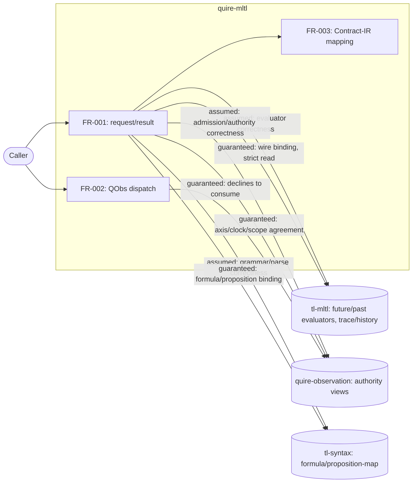

## Summary

Checked MRS-001's In Scope / Out of Scope statements and the FR-001/FR-002/FR-003
responsibility split against the actual `tl-mltl` source being ported
(`src/wire/{request,observation,report}.rs`, `src/mapping/contract_ir.rs`) for
scope creep, scope gaps, and internal contradiction between the MRS narrative
and the FR bodies. No scope creep or contradiction found; two low-severity
notes recorded for a future pass.

## System Context

## Responsibility Allocation

| Requirement | Owning Component | Class |
|---|---|---|
| FR-001 | quire-mltl | core |
| FR-002 | quire-mltl | core |
| FR-003 | quire-mltl | core |
| NFR-001 | quire-mltl (cites quire-contract-ir/PGM-01) | cross-cutting |
| Future/past truth evaluation | tl-mltl | external, assumed |
| Observation admission/replay/authority derivation/repair/query | quire-observation | external, assumed |
| Formula/proposition-map grammar and parsing | tl-syntax | external, assumed |

## Findings

| ID | Severity | Summary | Refs |
| --- | --- | --- | --- |
| FND-001 | low | No scope creep: FR-001/FR-002/FR-003 never claim to validate formula grammar, admit/replay observations, or perform repair/population-query evaluation; every such claim is explicitly declined (FR-002's "never accept, inspect, project, evaluate, or relabel a foreign artifact") or attributed to the owning repo. | FR-001, FR-002, FR-003 |
| FND-002 | low | No scope gap: `wire::common`'s shared canonical-bytes/identity/limits machinery isn't a separate FR, but is explicitly folded into MRS-001's In Scope closing bullet and FR-001's Behavior/Constraints rather than left undescribed. | MRS-001, FR-001 |
| FND-003 | low | MRS-001 does not use the literal "assumed vs. guaranteed" vocabulary for its three upstream dependencies; the distinction is present in substance (Out of Scope names what is consumed, not reimplemented) but not tabulated. Not fixed here — the existing prose form matches this org's established MRS convention (`tl-mltl`'s own MRS-001 uses the same narrative-only form), and introducing a new tabular convention unilaterally in one repo would be inconsistent rather than an improvement. | MRS-001 |
